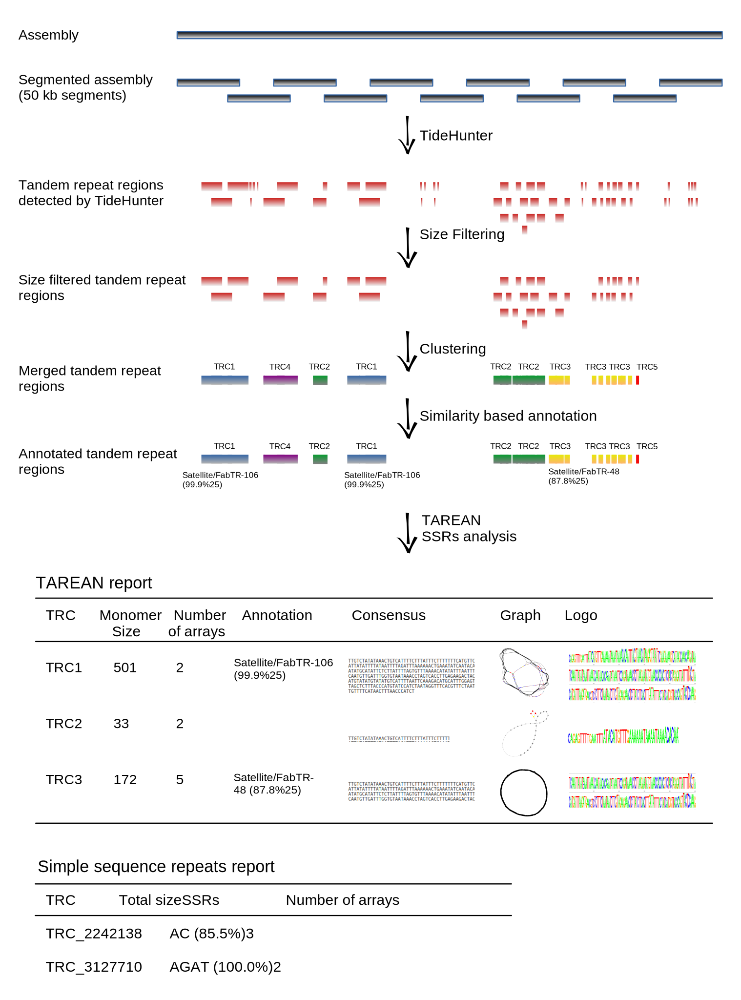

# TideCluster
[](https://zenodo.org/badge/latestdoi/601111441)
[](https://anaconda.org/petrnovak/tidecluster)


TideCluster is a software tool designed to identify tandem repeats in genome 
assemblies by utilizing [TideHunter](https://github.com/Xinglab/TideHunter) to detect tandem repeats clustering these repeats
based on similarity using mmseqs2 and NCBI BLAST. The software runs in four steps as  
outlined below:

**Tidehunter step**: In this initial step, Tidehunter is utilized to identify tandem 
repeats. As TideHunter's performance diminishes with larger sequences, the input fasta 
file is divided into smaller overlapping segments, with each segment analyzed 
individually.  Results from individual segments are parsed and merged into a single 
GFF3 file.  Tandem repeats detected in this step are often fragmented into multiple  
overlapping pieces.

**Clustering step**: Prior to clustering, all arrays that do not meet the minimum length 
requirement are removed from the analysis and saved in a separate GFF3 file. Arrays 
exceeding the minimum length requirement are clustered based on similarity. 
Clustering occurs in two stages. First, mmseqs2 is employed in the initial round of 
clustering. The second round involves an all-to-all comparison using NCBI-BLAST, 
followed by graph-based  clustering. The GFF3 file from the Tidehunter step is updated 
to include cluster assignment information. Simple sequence repeats are excluded from 
the clustering step and are analyzed separately.

**Annotation step**: Consensus sequences from TideHunter for each cluster are examined by 
RepeatMasker against a library of tandem repeats. The resulting annotation for each 
tandem repeat is used to update the information in the GFF3 file. This step is optional.

**TAREAN step**: In this final step, the Tandem Repeat Analyzer (TAREAN) estimates 
consensus sequences using a k-mer-based approach on the original sequences from the  
reference. Consensus sequences of simple sequence repeats are evaluated separately,  
as TAREAN performs poorly on tandem repeats with short monomers. The results of the  
analysis are saved in an HTML summary.

**TRC Consensus Clustering and Superfamily Analysis**
Consensus sequences from TAREAN are clustered to identify similary or nearly identical
TRCs tha were not clustered together initially in clustering step. This clustering groups
the TRCs into higher-level clusters referred to as Superfamilies, based on sequence
similarity.

**K-Mer Interval Tandem Repeat Estimation (KITE)**
The K-Mer Interval Tandem Repeat Estimation (KITE) method is applied to analyze individual
Tandem Repeat Arrays (TRAs) within each TRC. In contrast to TAREAN, which provides monomer
size estimates for the entire TRC, KITE also estimates monomer sizes for each array by
evaluating the distances between all repetitive k-mers across the tandem repeat array,
with each tandem array analyzed individually. This method facilitates the detection of
higher-order repeats and captures the variability in monomer size across different tandem
repeat arrays.

**How each array is described**

Each tandem repeat array (TRA) is summarised with a few terms:

| Term | In simple words |
|---|---|
| **Founder** | The basic repeat unit — the shortest building block the array is actually made of (its monomer). |
| **Strongest** | The period the sequence matches most precisely. Equals the founder for a simple array; a multiple of it when there is higher-order structure. |
| **Multiplicity (×k)** | How many founder copies make up the strongest unit. ×1 = no higher-order structure. |
| **HOR (higher-order repeat)** | An array where the strongest unit is k≥2 founders joined together — whole monomers organised into a larger repeating block. |
| **Subrepeat** | A short tandem repeat *inside* the founder monomer (period much shorter than the founder — only part of one monomer). The opposite direction to HOR: HOR groups whole monomers into a bigger unit, a subrepeat is a smaller pattern within a single monomer. |
| **SSR (simple sequence repeat)** | Just a tandem repeat with a very short monomer — a simple short motif repeated (e.g. `AT`, `ATC`). Recognised from its consensus; the motif and its length are reported directly. |
| **HOR-order confidence** | How trustworthy the ×k call is: **strict/supported** = a confident higher-order pattern; **weak** = the founder is reliable but the exact ×k is only approximate (very long, irregular, or rescued). |

In short: every array gets a *founder* (its monomer). If the cleanest match is
several whole founders long, it is an *HOR* (×k). If there is a shorter pattern
*within* the monomer, that is a *subrepeat*. An array whose monomer is itself a
very short simple motif is an *SSR*.

These calls come from two complementary signals that TideCluster (via `kitehor`)
measures along each array. The first is **periodicity**: the array is scanned for
the spacing at which its sequence repeats, yielding a set of candidate monomer
sizes, each with a strength score (how dominant that period is). The second is an
**identity scan**: for each candidate period, copies one period apart are
compared and their median sequence identity is recorded — a genuine repeat unit
has well-conserved copies (high identity), whereas a spurious period does not.
The **founder** is the shortest period that is both a real divisor of the array
and well-conserved; the **strongest** is the best-conserved period overall. When
the strongest is a whole-number multiple of the founder, the array is an **HOR**.

Starting in TideCluster 1.10.0, the KITE step is powered by
[kitehor](https://github.com/kavonrtep/kitehor) (`0.13.2` since
TideCluster 1.14.1) — a sequence-agnostic Rust reimplementation of the
same k-mer-interval principle. The pipeline runs `kitehor
kite-periodicity` and `kitehor rule-classify`, followed in parallel by
`kitehor rescore` (banded semi-global alignment scoring of the top-N
kite peaks), `kitehor ssr-scan`, and `kitehor tandem-validate` (the
unified spatial-localization nested-TR / subrepeat detector); the
heavier `analyze` cascade is dropped. kitehor is installed transitively
from the `petrnovak` conda channel.

The KITE analysis includes:

- Monomer size estimate for the entire TRC : This estimate may differ from the TAREAN
estimate due to the different methodologies employed.
- Monomer size estimates for individual TRAs : These estimates are provided as:
   - Primary estimate : The estimate with the highest score.
   - Alternative estimates : Estimates with lower scores, these estimates help in identifying
higher-order repeats.
- Per-array founder / strongest / multiplicity: from the rescored
  peaks, TideCluster derives the **strongest** period (rescore's
  `founder_period` = highest identity_med) and reassigns the **founder**
  to the smallest peak P whose period is an integer divisor of the
  strongest (k = strongest/P) with `identity_med(P) ≥ 0.7` — recovering
  the HOR base / tile decomposition. When rescore cannot assign a
  founder, TideCluster falls back to the top-scored kite peak and marks
  the array with a `*` in the report. Since 1.13.0 a final *go-deeper*
  pass also consults kitehor's own per-array basic monomer
  (`hor_basic_period`) and adopts it when it is a meaningfully deeper
  (≥ 20 %), clean, near-full-coverage array-wide tandem that the strict
  divisor gate missed (`founder_method = kh_deeper`).
- Harmonic-ladder founder: for a **divergent** HOR satellite the basic
  monomer can fall *below* the `identity_med ≥ 0.7` gate (its copies are
  only ~65–70 % identical) while the higher-order unit is conserved — so
  the founder defaults to the HOR unit. When the strongest period sits
  atop a clean **harmonic ladder** (peaks at integer multiples of the
  fundamental: ≥ 3 distinct rungs, or an exceptionally-clean ×2 whose
  double is a genuinely more-conserved HOR unit), TideCluster adopts the
  fundamental as the founder with the implied ×k
  (`founder_method = ladder`, HOR-order tier `supported`) — e.g. recovering
  a 179 bp monomer reported as ×6 of a 1073 bp unit.
- Short-founder review aids (since 1.14.1): a short founder (≤ 30 bp)
  whose founder peak has weak kite support (score < 0.20) is flagged
  (`weak_short_founder_flag`) with its dominant longer-period alternative
  (`alt_longer_period`) and an amber `⚠short` badge in the report, so the
  rare surviving weak short call can be eyeballed. Purely diagnostic — the
  founder call is unchanged.
- Subrepeat candidates: since 1.13.0 sourced from `kitehor
  tandem-validate` and gated against TideCluster's founder — only
  genuine partial-occupancy nested motifs that do **not** coincide with
  the founder/HOR subunit are surfaced (density ≥ 0.10, presence
  ≥ 10 %). Strict by design — a true nested subrepeat is a short motif
  occupying only part of each longer monomer, not an HOR pattern that
  tiles the whole longer monomer. A candidate that is instead a clean
  high-occupancy integer divisor of the founder is flagged
  (`subrepeat_founder_divisor_flag`) as a possible-founder-miscall
  watch-list entry rather than reported as a subrepeat.
- SSR scan with dominant motif, total coverage, and top motifs.
- All surfaced in the report's KITE page, the per-TRC dashboards
  (▸ click opens the per-array Details child row with the full
  rescore diagnostics), and the per-array columns of
  `monomer_size_top3_estimats.csv`.

|  |
|:-----------------------------------------------:|
|           TideCluster workflow scheme           |

## Concepts: Family, Superfamily, and the continuum of satellite repeats

- **Family (TRC, Tandem Repeat Cluster)** — a group of tandem repeat
  arrays whose monomer sequences are nearly identical. Arrays are
  assigned to the same family when their monomers align at
  ≥ 75 % sequence identity over ≥ 80 % of the shorter sequence
  (the defaults `--cluster_identity 75 --cluster_coverage 0.8`; see
  *Advanced: tuning the clustering thresholds* below);
  similarity is propagated transitively, so if array A is similar to
  B and B to C at these thresholds, A, B and C are one family. TRCs
  are numbered `TRC_1`, `TRC_2`, … in decreasing order of total array
  length.
- **TRA (Tandem Repeat Array)** — a single genomic instance
  belonging to a family. Each TRA has a seqid, start, end, and
  length.
- **Superfamily** — a group of families whose consensus sequences
  share BLAST similarity above a score gate (default
  `--superfamily_score 20`). Because this criterion is
  looser than family assignment, superfamilies can join families
  that share only a local region of their consensus, or families
  whose monomers differ in length — for example when one family's
  monomer is contained inside the longer monomer of another family.
  Higher-order repeat relationships are included but are not the
  only source of superfamily membership.

> In satellite-rich genomes tandem repeats often form a continuum of
> related sequences rather than discrete groups; the family and
> superfamily boundaries reported by TideCluster are operational
> summaries at fixed thresholds, not clear-cut biological clades.

### Advanced: tuning the clustering thresholds (expert use)

The similarity thresholds that define families and superfamilies are
exposed as command-line options, but **the defaults are a tuned,
validated operating point and should be left unchanged for routine
use.** They were chosen so that known satellite and rDNA families are
recovered as coherent clusters; changing them alters how aggressively
arrays and clusters are merged and moves the family / superfamily
boundaries accordingly. Adjust them only if you understand the effect
and have a specific reason to — for example, deliberately exploring a
diverged continuum of variants. If in doubt, do not change them.

| Step | Option | Default | Effect of changing |
|------|--------|--------:|--------------------|
| Family (TRC) clustering | `--cluster_identity` | 75 | minimum BLASTN % identity for an array–array edge; **lower** = looser families (more merging), **higher** = stricter (more, smaller families) |
| Family (TRC) clustering | `--cluster_coverage` | 0.8 | minimum alignment coverage over the shorter array, a fraction in (0, 1] |
| Superfamily grouping | `--superfamily_score` | 20 | minimum consensus-vs-consensus BLAST score `(length · pident − gap_openings) / longer_consensus_length`; **lower** = looser superfamilies |

The comparative cross-genome grouping has its own thresholds
(`--min_identity`, `--min_coverage`, `--coverage_mode`,
`--lowcomplexity_mask`, and the Leiden resolution; see
`tc_comparative_analysis.R --help`), to which the same "defaults are tuned,
change only if you know why" guidance applies.

Values outside their valid range are rejected before the run starts
(for example a coverage fraction mistakenly given as a percent);
biologically unusual but valid values emit a warning and proceed.

## Installation

TideCluster ships in two forms — a conda package on `anaconda.org/petrnovak`
and a Singularity / Apptainer container on GitHub Container Registry. Both
are produced from the same release tag. Pick whichever fits your
environment.

### Conda / Mamba

The recommended installer is [Mamba](https://github.com/mamba-org/mamba)
(faster than classic conda). If you do not already have Mamba, install
[Miniforge](https://github.com/conda-forge/miniforge) — it ships with
Mamba preconfigured for the conda-forge channel:

```bash
# https://github.com/conda-forge/miniforge#install
curl -L -O https://github.com/conda-forge/miniforge/releases/latest/download/Miniforge3-$(uname)-$(uname -m).sh
bash Miniforge3-$(uname)-$(uname -m).sh
```

Then create a TideCluster environment:

```bash
mamba create -n tidecluster -c conda-forge -c bioconda -c petrnovak tidecluster
mamba activate tidecluster
TideCluster.py --version
```

To pin a specific release, append `=<version>` (e.g.
`tidecluster=1.16.2`).

### Singularity / Apptainer

Pre-built SIF images are published as OCI artefacts on GHCR:

```bash
apptainer pull oras://ghcr.io/kavonrtep/tidecluster/sif:latest
# or pin a release:
# apptainer pull oras://ghcr.io/kavonrtep/tidecluster/sif:1.16.2

apptainer exec tidecluster_latest.sif TideCluster.py --version
```

Bind the directory containing your inputs/outputs with `-B`:

```bash
apptainer exec -B "$PWD" tidecluster_latest.sif \
    TideCluster.py run_all -c 40 -pr sample -f genome.fasta
```

The container bundles every CLI listed in [Usage](#usage), including
the standalone wrappers (`tc_reannotate.py`, `tc_per_tra_consensus.py`,
`tc_comparative_analysis.R`, etc.).

### Building the container locally

If you prefer to build the SIF yourself from the checked-out source
tree (e.g. on an offline cluster):

```bash
git clone https://github.com/kavonrtep/TideCluster.git
cd TideCluster
sudo apptainer build TideCluster.sif TideCluster.def
```

The recipe (`TideCluster.def`) installs the runtime dependencies from
`conda-forge` + `bioconda` only and bakes the cloned source tree into
the image. Build time is ~15 min on a typical workstation.

### TideHunter "Illegal instruction"

On older CPUs without AVX, the bioconda TideHunter binary may abort
with `Illegal instruction`. Compile from source and replace the conda
binary inside an activated TideCluster environment:

```bash
wget https://github.com/yangao07/TideHunter/releases/download/v1.4.3/TideHunter-v1.4.3.tar.gz
tar -zxvf TideHunter-v1.4.3.tar.gz && cd TideHunter-v1.4.3
make
cp bin/TideHunter $CONDA_PREFIX/bin
```


## Usage

```help
usage: TideCluster.py [-h] [-v] {tidehunter,clustering,annotation,tarean,run_all} ...

Wrapper of TideHunter
    This script enable to run TideHunter on large fasta files in parallel. It splits
    fasta file into chunks and run TideHunter on each chunk. Identified tandem repeat 
    are then clustered, annotated and representative consensus sequences are extracted.
    
     
    

positional arguments:
  {tidehunter,clustering,annotation,tarean,run_all}
                        TideHunter wrapper
    tidehunter          Run wrapper of TideHunter
    clustering          Run clustering on TideHunter output
    annotation          Run annotation on output from clustering stepusing reference library of tandem repeats
    tarean              Run TAREAN on clusters to extract representative sequences
    run_all             Run all steps of TideCluster

options:
  -h, --help            show this help message and exit
  -v, --version         show program's version number and exit

    Example of usage:

    # first run tidehunter on fasta file to generate raw GFF3 output
    TideCluster.py tidehunter -c 10 -f test.fasta -pr prefix

    # then run clustering on the output from previous step to cluster similar tandem repeats
    TideCluster.py clustering -c 10 -f test.fasta -pr prefix -m 5000

    # then run annotation on the clustered output to annotate clusters with reference
    # library of tandem repeats in RepeatMasker format
    TideCluster.py annotation -c 10 -pr prefix -l library.fasta

    # then run TAREAN on the annotated output to extract representative consensus
    # and generate html report
    TideCluster.py tarean -c 10 -f test.fasta -pr prefix

    Recommended parameters for TideHunter:
    short monomers: -T "-p 10 -P 39 -c 5 -e 0.25"
    long monomers: -T "-p 40 -P 3000 -c 5 -e 0.25" (default)

    The increasing -p and -P values can be used to target longer monomers but it will lead
    to increased computational time. If you need to target monomers for up to 25000 bp,
    it is recommended to use --long option which will run TideHunter in three rounds
    with increasing monomer size ranges (40-3000, 3001-10000, 10001-25000). After each round,
    identified tandem repeats are masked in the input sequences for the next round. This
    approach improves detection of long monomers while keeping computational time manageable.

    For parallel processing include -c option before command name.

    For more information about TideHunter parameters see TideHunter manual.

    Library of tandem repeats for annotation step are sequences in RepeatMasker format
    where header is in format:

    >id#clasification
```

## TideHunter step

```help
usage: TideCluster.py tidehunter [-h] -f FASTA -pr PREFIX [-T [TIDEHUNTER_ARGUMENTS] | --long] [--keep_rounds] [-c CPU]

options:
  -h, --help            show this help message and exit
  -f FASTA, --fasta FASTA
                        Path to reference sequence in fasta format (gzipped files supported)
  -pr PREFIX, --prefix PREFIX
                        Base name for output files
  -T [TIDEHUNTER_ARGUMENTS], --tidehunter_arguments [TIDEHUNTER_ARGUMENTS]
                        additional arguments for TideHunter in quotes, default value: -p 40 -P 3000 -c 5 -e 0.25)
  --long                Run TideHunter in three rounds with increasing monomer sizes (40-25000 nt)
  --keep_rounds         Keep intermediate GFF3 files from each round for debugging (only with --long)
  -c CPU, --cpu CPU     Number of CPUs to use
```

## Clustering step

```help
usage: TideCluster.py clustering [-h] -f FASTA [-m MIN_LENGTH] -pr PREFIX [-g GFF] [-nd] [-c CPU]

options:
  -h, --help            show this help message and exit
  -f FASTA, --fasta FASTA
                        Reference fasta (gzipped files supported)
  -m MIN_LENGTH, --min_length MIN_LENGTH
                        Minimum length of tandem repeat array to be included in clustering step. Shorter arrays are discarded, default (5000)
  -pr PREFIX, --prefix PREFIX
                        Prefix is used as a base name for output files.If --gff is not provided, prefix will be also usedto identify GFF file from previous tidehunter step
  -g GFF, --gff GFF     GFF3 output file from tidehunter step. If not provided the file named 'prefix_tidehunter.gff3' will be used
  -nd, --no_dust        Do not use dust filter in blastn when clustering
  -c CPU, --cpu CPU     Number of CPUs to use

```

## Annotation step

```help
usage: TideCluster.py annotation [-h] -pr PREFIX [-g GFF] [-cd CONSENSUS_DIRECTORY] -l LIBRARY [-c CPU]

options:
  -h, --help            show this help message and exit
  -pr PREFIX, --prefix PREFIX
                        Prefix is used as a base name for output files.If --gff is not provided, prefix will be also usedto identify GFF3 file from previous clustering step
  -g GFF, --gff GFF     GFF3 output file from clustering step. If not provided the file named 'prefix_clustering.gff3' will be used
  -cd CONSENSUS_DIRECTORY, --consensus_directory CONSENSUS_DIRECTORY
                        Directory with consensus sequences which are to be annotated. If not provided the directory named 'prefix_consensus' will be used
  -l LIBRARY, --library LIBRARY
                        Path to library of tandem repeats
  -c CPU, --cpu CPU     Number of CPUs to use
```

LIBRARY is fasta file with tandem repeats reference library.
Required format for sequence names  in fasta is `>seqid#class/subclass`


## TAREAN step

```help
usage: TideCluster.py tarean [-h] [-g GFF] -f FASTA -pr PREFIX [-c CPU] [-M MIN_TOTAL_LENGTH]

options:
  -h, --help            show this help message and exit
  -g GFF, --gff GFF     GFF3 output file from annotation or clustering stepIf not provided the file named 'prefix_annotation.gff3' will be used instead. If 'prefix_annotation.gff3' is not
                        found, 'prefix_clustering.gff3' will be used
  -f FASTA, --fasta FASTA
                        Reference fasta (gzipped files supported)
  -pr PREFIX, --prefix PREFIX
                        Prefix is used as a base name for output files.If --gff is not provided, prefix will be also usedto identify GFF3 files from previous clustering/annotation step
  -c CPU, --cpu CPU     Number of CPUs to use
  -M MIN_TOTAL_LENGTH, --min_total_length MIN_TOTAL_LENGTH
                        Minimum combined length of tandem repeat arrays within a single cluster, required for inclusion in TAREAN analysis. Default (50000)

```

## rDNA identification

During `run_all` (and the `tarean` step) TideCluster also flags which TRCs are
**ribosomal DNA**, distinguishing **45S** (18S–5.8S–25S) from **5S** rDNA by
similarity to a bundled reference library (`data/rdna_library.fasta`, in
RepeatMasker `name#class` format with classes `rDNA_45S/*` and `rDNA_5S/*`).

A TRC is labelled from the **best single-subunit reference coverage**: it is
called rDNA if one library reference (e.g. an 18S or 25S gene) is matched
near-full-length at high identity. This deliberately ignores ITS/IGS spacer
(absent from the library, so whole-monomer coverage is diluted) and tolerates
cross-species divergence (default identity gate 85 %). The search is
consensus-first (TAREAN consensus, else the raw TideHunter clustering consensus)
with a genomic-array fallback for TRCs that have no usable consensus.

The call is written **into the clustering GFF3** as a clean attribute, e.g.:

```
OZ408684.1  TideCluster  tandem_repeat  187618  335146  1  .  .  Name=TRC_1;repeat_type=TR;rDNA_type=45S;rDNA_coverage=1.0
```

and a per-TRC table is written to `<prefix>_rdna.tsv`. The HTML report lists the
rRNA/rDNA TRCs on the summary page and marks each TRC's page. Several TRCs can be
`45S` (e.g. variants spanning one large array). Disable with `--no_rdna`; tune
with `--rdna_library`, `--rdna_min_coverage` (0.7), `--rdna_min_identity` (85).

To re-run identification on an existing run (for example after extending the
library), use the standalone subcommand:

```bash
TideCluster.py rdna -pr prefix -f genome.fasta [--rdna_library lib.fasta] [-c CPU]
```

Note: 45S monomers are large (~9–12 kb), so a clean 45S TRC usually requires
running TideHunter in `--long` mode (the default period cap is 3000 bp).

## Run all steps

```help
usage: TideCluster.py run_all [-h] -f FASTA -pr PREFIX [-l LIBRARY] [-m MIN_LENGTH] [-T [TIDEHUNTER_ARGUMENTS] | --long] [--keep_rounds] [-nd] [-c CPU] [-M MIN_TOTAL_LENGTH]

options:
  -h, --help            show this help message and exit
  -f FASTA, --fasta FASTA
                        Reference fasta (gzipped files supported)
  -pr PREFIX, --prefix PREFIX
                        Base name used for input and output files
  -l LIBRARY, --library LIBRARY
                        Path to library of tandem repeats
  -m MIN_LENGTH, --min_length MIN_LENGTH
                        Minimum length of tandem repeat (5000)
  -T [TIDEHUNTER_ARGUMENTS], --tidehunter_arguments [TIDEHUNTER_ARGUMENTS]
                        additional arguments for TideHunter in quotes, default value: -p 40 -P 3000 -c 5 -e 0.25)
  --long                Run TideHunter in three rounds with increasing monomer sizes (40-25000 nt)
  --keep_rounds         Keep intermediate GFF3 files from each round for debugging (only with --long)
  -nd, --no_dust        Do not use dust filter in blastn when clustering
  -c CPU, --cpu CPU     Number of CPUs to use
  -M MIN_TOTAL_LENGTH, --min_total_length MIN_TOTAL_LENGTH
                        Minimum combined length of tandem repeat arrays within a single cluster, required for inclusion in TAREAN analysis. Default (50000)
```

## Example for full pipeline

```help
TideCluster.py tidehunter -c 40 -pr cen6_sat -f CEN6_ver_220406.fasta 
TideCluster.py clustering -c 40 -pr cen6_sat -f CEN6_ver_220406.fasta
TideCluster.py annotation -c 40 -pr cen6_sat -l library.fasta
TideCluster.py tarean -c 40 -pr cen6_sat -f CEN6_ver_220406.fasta

# or simpli run all steps at once
TideCluster.py run_all -c 40 -pr cen6_sat -f CEN6_ver_220406.fasta -l library.fasta 
```

## Output

### Tidehunter Step

- `prefix_tidehunter.gff3` - GFF3 file with tandem repeats detected by TideHunter.
- `prefix_chunks.bed` - BED file showing how the reference sequence was split into chunks for parallel processing.

### Clustering Step

- `prefix__tidehunter_short.gff3` GFF3 file with tandem repeats shorter than the minimum length threshold used in the clustering step. 
- `prefix_clustering.gff3` - GFF3 file with tandem repeats identified by `mmseqs2` and `BLASTN`. 
  Tandem repeat regions in the GFF3 file are labeled by **T**andem **R**epeat **C**luster ID (TRC1, TRC2, etc.). Each TRC is described by the `repeat_type` attribute. `repeat_type` can be either TR (Tandem Repeat) or SSR (Simple Sequence Repeat).
  By default this GFF3 is made **non-overlapping across TRCs** (each genomic
  region is annotated once): where variant arrays of a satellite are clustered
  into separate TRCs that overlap at their boundaries, each contested span is
  assigned to the dominant TRC — the one with the largest total array length.
  No base of the union is lost (spans are reassigned, not dropped). Pass
  `--keep_overlaps` to retain the raw, possibly overlapping regions.
- `prefix_clustering.gff3_1.gff3` - Intermediate file with tandem repeats clustered by `mmseqs2`.
- `prefix_consensus` - Directory with consensus sequences for each cluster as identified by TideHunter. There is one FASTA file per cluster. Each FASTA file contains all consensus sequences identified by TideHunter for a given cluster. 
- `prefix_consensus_1` - Intermediate directory with consensus sequences for each cluster as identified by `mmseqs2`. 
- `prefix_clustering_split_files` - Directory with GFF3 files, one for each TRC cluster. Each GFF3 file contains tandem repeat regions for a single TRC cluster.

### Annotation Step

- `prefix_annotation.gff3` - GFF3 file with tandem repeats annotated by RepeatMasker. 
  Annotations are shown as additional attributes in the GFF3 file.
- `prefix_annotation.tsv` - Summarized annotation for each TRC cluster in a tab-delimited format.
- `prefix_annotation_split_files` - Directory with GFF3 files, one for each TRC cluster. 
  Each GFF3 file contains tandem repeat annotations for a single TRC cluster.

### TAREAN Step

- `prefix_index.html` - Main HTML report, other reports are linked from this file.
- `prefix_tarean_report.html` - HTML report with tandem repeat annotations. 
- `prefix_tarean_report.tsv` - File with tandem repeat annotations in a tab-delimited format.
- `prefix_kite_report.html` - HTML report with KITE analysis.
- `prefix_trc_superfamilies.html`  HTML report with TRC superfamilies.
- `prefix_trc_superfamilies.csv`  Table of TRC-to-superfamily assignments
  (comma-separated, columns `Superfamily,TRC,fallback`). Always written under
  this name, even when no superfamilies are found — in that case it has the
  header only and zero data rows.
- `prefix_trc_superfamilies.manifest.json`  Small manifest declaring the
  superfamily artefacts (the CSV/HTML basenames, the CSV column schema, and
  whether any superfamilies were found), so downstream tools key on a stated
  contract rather than on guessed filenames.
- `prefix_tarean` - Directory containing subdirectories with detailed TAREAN output for each TRC cluster.
- `prefix_consensus_dimer_library.fasta` - FASTA file with consensus sequences for 
  each TRC cluster. This sequences can be used as a library for similarity based 
  annotation using RepeatMasker. This file is created only for TRC clusters that 
  pass the minimum combined length threshold.


## Updating gff3 file based on manual annotation
If you want to update GFF3 file with manual annotation, you can use `tc_update_gff3.py` 
script. This script will update "Name" attribute in GFF3 based on the conversion 
table. Conversion table is tab-delimited file with two columns. First column is 
original value of Name attribute and the second column is a new value.


```help
usage: tc_update_gff3.py [-h] -g GFF3 -t TABLE -o OUTPUT [-a ATTRIBUTE_NAME]

Update gff3 attributes based on conversion table.

options:
  -h, --help            show this help message and exit
  -g GFF3, --gff3 GFF3  gff3 file
  -t TABLE, --table TABLE
                        Conversion table as tab-delimited file. First column if original attribute value, second column is new attribute value.
  -o OUTPUT, --output OUTPUT
                        output file gff3
  -a ATTRIBUTE_NAME, --attribute_name ATTRIBUTE_NAME
                        attribute name to update, default attribute is "Name"

```

## Reannotation of tandem repeats using similarity based approach

`TideCluster.py tarean` step produces FASTA file with representative sequences for each 
TRC which can be used as library for similarity based annotation using RepeatMasker. 
This library file is available in `prefix_consensus_dimer_library.fasta`.
Similarity based annotation can fill gaps in annotation of tandem repeats provided by 
TideCluster/TideHunter. To reannotate tandem repeats using RepeatMasker, you can use 
tc_reannotate.py script. This script will run RepeatMasker using TRC library and then 
filter RepeatMasker output to retain only high-quality TRC hits. Overlapping TRC hits
are merged and regions shorter than twice the monomer length are excluded from the output.

When a genome is supplied with `-s/--ref_seq`, RepeatMasker is parallelised by
**chunking the genome** rather than relying on RepeatMasker's `-pa` (which does
not parallelise effectively with a custom `-lib` on the RMBlast engine, and
whose single-threaded `ProcessRepeats` stage `-pa` cannot parallelise at all).
The genome is split into pieces of about `--chunk_size` bases and one
single-threaded RepeatMasker runs per piece in a pool of `-c/--cpu` workers, so
both the search and each piece's `ProcessRepeats` run concurrently; hits are
then mapped back to genome coordinates. Sequences shorter than `2*chunk_size`
are only packed (never cut), so their annotation is **byte-identical** to a
whole-genome run; only larger sequences are split, where RepeatMasker's
context-dependent `ProcessRepeats` can shift a few hits at the cuts (typically
well under the project's ±0.15 % masked-bp losslessness bar). Increase
`--chunk_size` for stricter equivalence, decrease it for more parallelism.

### Usage:

```help
usage: tc_reannotate.py [-h] (-r REPEATMASKER_FILE | -s REF_SEQ) -f FASTA_FILE [-c CPU]
                        [--chunk_size CHUNK_SIZE] [--overlap OVERLAP]
                        [--sensitivity {quick,default,rush}] -o OUTPUT [-d]

options:
  -h, --help            show this help message and exit
  -r REPEATMASKER_FILE, --repeatmasker_file REPEATMASKER_FILE
                        RepeatMasker output file
  -s REF_SEQ, --ref_seq REF_SEQ
                        FASTA file to annotated by TRC library
  -f FASTA_FILE, --fasta_file FASTA_FILE
                        Fasta file wiht TRC library used for RepeatMasker search
  -c CPU, --cpu CPU     Number of CPUs to use
  --chunk_size CHUNK_SIZE
                        Genome chunk size (bp) for parallel RepeatMasker when
                        --ref_seq is given. Sequences shorter than 2*chunk_size are
                        only packed (byte-identical); larger ones are split across
                        a pool of --cpu workers (default: 50000000)
  --overlap OVERLAP     Overlap (bp) between adjacent genome chunks; must exceed
                        the longest library entry so no hit is lost at a chunk
                        boundary (default: 100000)
  --sensitivity {quick,default,rush}
                        RepeatMasker sensitivity preset to use when --ref_seq is
                        provided
  -o OUTPUT, --output OUTPUT
                        GFF3 output file
  -d, --debug           Keep temp files for debuging

```


## Per-TRA consensus generation

Builds one consensus monomer per Tandem Repeat Array (TRA), validates
it by self-BLAST against the source array, and attaches a per-TRA
quality grade plus diagnostic flags. Distinct from the per-TRC
consensus already emitted by the TAREAN step.

Run as a post-processing pass on an existing `TideCluster.py run_all`
output (not yet wired into `TideCluster.py` itself):

```bash
tc_per_tra_consensus.py -p <prefix> [-c CPU]
```

Internally combines two complementary methods:

1. **Array-MSA consensus** — extracts in-phase monomer copies from
   each genomic array via a k-mer phase anchor and aligns them with
   MAFFT.
2. **TideHunter consensus** — uses TideHunter's own per-fragment
   consensus, picking the best fragment per TRA.

Then a **consensus selector** chooses the better of the two by
self-BLAST coverage, computes per-copy identity dispersion and
internal-gap metrics, and assigns each TRA a quality grade (A clean /
B qualified / C low / D unusable) and independent diagnostic flags
(`boundary_overext`, `internal_gap`, `heterogeneous`, `low_pident`).

Outputs land in `<prefix>_per_tra_consensus/`:

- `per_tra_consensus.fasta` — selected consensus per TRA, source
  method noted in the header.
- `per_tra_metrics.tsv` — coverage, core-region metrics, identity
  dispersion, internal-gap counts, grade, flags, KITE annotation.
- `summary.log` — totals and threshold values.

Full vocabulary, output column reference, threshold parameters, and
manual step-by-step invocation are in
[`docs/per_tra_consensus.md`](docs/per_tra_consensus.md).


## TRC Comparative Analysis

The `tc_comparative_analysis.R` script performs comparative analysis of Tandem Repeat Clusters (TRCs) across multiple samples, grouping similar TRCs into satellite families based on sequence similarity. This analysis enables identification of conserved tandem repeat families across different samples and provides annotation and length statistics for each family.

### Purpose

The script performs several key functions:
1. **Sequence clustering**: Groups TRCs from multiple samples based on sequence similarity using MMseqs2
2. **Graph-based community detection**: Identifies satellite families with a community-detection algorithm (fast-greedy by default; louvain and leiden also supported)
3. **Annotation integration**: Incorporates annotation data from RepeatMasker analysis
4. **Length calculation**: Computes total lengths of TRCs within each family across samples
5. **SSRS analysis**: Processes Simple Sequence Repeat (SSR) data alongside TRC data
6. **Comprehensive reporting**: Generates detailed output tables and re-annotated GFF files

### Input Requirements

The script requires a tab-delimited input configuration file with the following columns:

- `input_dir`: Path to the TideCluster output directory containing TRC data
- `sample_code`: Unique identifier for each sample (used as column prefixes in output)
- `tidecluster_prefix`: Prefix used for TideCluster output files (typically "tc")

**Example input file:**
```tsv
input_dir	                         sample_code	tidecluster_prefix
/path/to/sample1/tidecluster_output	 Sample1	    tc
/path/to/sample2/tidecluster_output	 Sample2	    tc
/path/to/sample3/tidecluster_output	 Sample3	    tc
```

Each input directory should contain the standard TideCluster output files:
- `{prefix}_consensus_dimer_library.fasta`: Consensus sequences for clustering
- `{prefix}_consensus/consensus_sequences_all.fasta`: All consensus sequences
- `{prefix}_clustering.gff3`: TRC clustering results
- `{prefix}_annotation.tsv`: Annotation data (optional)
- `{prefix}_tarean/SSRS_summary.csv`: SSR data (optional)

### Usage

```bash
Rscript tc_comparative_analysis.R -i input_config.tsv -o output_directory -c 10
```

**Command-line options:**
- `-i, --input`: Input configuration file (required)
- `-o, --output_directory`: Output directory for results (default: "tc_comparative_analysis")
- `-c, --cpu`: Number of CPU threads for MMseqs2 (default: 5)
- `--min_identity`: Minimum percent identity (0–100) for two TRCs to be linked
  in the similarity graph (default: 80)
- `--min_coverage`: Minimum alignment coverage (0–1) for two TRCs to be linked;
  how this is applied to the two sequences is controlled by `--coverage_mode`
  (default: 0.8)
- `--coverage_mode`: How `--min_coverage` is applied to the per-sequence coverage
  values returned by MMseqs2 — `max` (default; accepts a hit that covers most of
  *either* sequence, so a short monomer can join a longer family as a subset) or
  `min` (requires both sequences to be well covered, rejecting short-vs-long
  subset hits). See *How similarity between TRCs is evaluated* below.
- `--lowcomplexity_mask`: MMseqs2 tantan low-complexity masking in the all-vs-all
  search — `1` = on (default, unchanged behaviour) or `0` = off. For satellites
  whose monomers are AT-rich / contain simple-repeat stretches, masking removes
  most of the alignable sequence, so highly similar TRCs fail the coverage cut and
  one biological family fragments across many comparative families. Set `0` to
  recover those families. **Caveat:** with masking off, *unrelated* AT-rich /
  low-complexity satellites can also align and over-merge into one family, so keep
  the default on unless you know your target satellites are simple-repeat-rich and
  have checked the impact. Note that an existing `mmseqs2_results.rds` in the
  output directory is reused as-is — to change masking, run into a fresh output
  directory (or delete that file first).

### How similarity between TRCs is evaluated

The script collects the consensus sequence of every TRC from every sample and
runs an all-vs-all comparison with **MMseqs2** (a fast nucleotide search engine).
For each alignment, MMseqs2 reports two coverage numbers — `qcov` (the fraction
of the *query* sequence that aligned) and `tcov` (the fraction of the *target*
sequence that aligned) — along with a percent identity.

Two TRCs are linked in the similarity graph only when their best alignment
passes two thresholds:

- **percent identity** ≥ `--min_identity` (default 80) — how similar the aligned
  letters are;
- **coverage** ≥ `--min_coverage` (default 0.8 = 80 %) — how much of the
  consensus the alignment spans.

Because the two consensus sequences are usually different lengths, you choose
via `--coverage_mode` how the two coverage numbers are combined:

- **`max` (default)** — `max(qcov, tcov) ≥ min_coverage`. A hit that covers
  most of *either* sequence survives, so a short basic monomer (e.g. 53 bp)
  can be attached to a long higher-order repeat family (e.g. ~8 kb) as a
  subset.
- **`min`** — `min(qcov, tcov) ≥ min_coverage`. *Both* sequences must be well
  covered. Subset hits where a short sequence aligns to only part of a long
  family are rejected, so each satellite family is built from consensus
  sequences that are roughly the same length and align end-to-end.

Each surviving alignment becomes an edge in the TRC similarity graph; the edge
weight is `selected_coverage × percent_identity`. Connected TRCs are then
grouped into **satellite families** using one of the supported community-detection
algorithms (`--clustering_algorithm`: `fast_greedy` by default; `louvain` or
`leiden` also available). Both `max(qcov, tcov)` and `min(qcov, tcov)` are
retained in `mmseqs2_results.tsv` so you can inspect why an edge did or did
not survive without re-running the search.

### Output Files

The script generates several output files in the specified output directory:

#### Primary Output Tables

**`trc_satellite_families.tsv`** - Main results table containing satellite family information:

| Column Type               | Column Name                | Description                                                                               |
|---------------------------|----------------------------|-------------------------------------------------------------------------------------------|
| **Family ID**             | `Satellite_family`         | Unique identifier for each satellite family (ranked by total length)                      |
| **TRC Composition**       | `{sample}_code`            | Comma-separated list of TRC IDs belonging to this family in each sample                   |
| **Length Statistics**     | `{sample}_length`          | Total genomic length (bp) of all TRCs in this family for each sample                      |
| **Detailed Annotations**  | `{sample}_annot`           | Detailed annotation with percentages for each sample (e.g., "Satellite/FabTR-10 (95.3%)") |
| **Prevalent Annotations** | `{sample}_prevalent_annot` | Annotations comprising >50% of the family in each sample                                  |
| **Consensus Annotation**  | `prevalent_annot`          | Combined prevalent annotations across all samples                                         |

**Example row:**
```
Satellite_family: 1
JI1006: TRC_1
IPIP202077: TRC_1, TRC_365  
IPIP200579: TRC_1
JI281: TRC_1
JI1006_length: 18737956
IPIP202077_length: 18130289
IPIP200579_length: 17011299
JI281_length: 15405217
JI1006_annot: Satellite/FabTR_PisTR-B (98.8%)
IPIP202077_annot: Satellite/FabTR_PisTR-B (98.4%)
IPIP200579_annot: Satellite/FabTR_PisTR-B (98.7%)
JI281_annot: Satellite/FabTR_PisTR-B (98.5%)
prevalent_annot: Satellite/FabTR_PisTR-B
```

**`ssrs_groups.tsv`** - Simple Sequence Repeat clustering results:
- Groups SSRs with similar repeat motifs across samples
- Contains TRC IDs and SSR types for each cluster
- Filters SSRs by minimum percentage threshold (default: 10%)

#### Supporting Files

**`annotation_report.txt`** - Summary statistics of annotation coverage:
- Total number of satellite families
- Families with/without annotations
- Annotation mapping statistics

**`gff3/`** directory - Annotated GFF3 files for each sample:
- `{sample}_tc_annotated.gff3`: Original GFF3 files with added satellite family and SSR annotations
- Includes `Satellite_family` and `ssrs_type` attributes

**Technical Output Files:**
- `mmseqs2_results.tsv`: Raw MMseqs2 similarity search results
- `trc_graph.graphml`: Graph representation of TRC similarities (for visualization)
- `trc_graph.rds`: R binary format of the similarity graph


### Interpretation Guidelines

**Satellite Families**: Numbered by total genomic length across all samples (Family 1 = largest)

**TRC Composition**: Multiple TRCs from the same sample in one family indicates:
- High sequence similarity between originally separate clusters
- Possible fragmentation during initial clustering
- Evolutionary related repeat variants

**Length Variations**: Differences in family lengths across samples may indicate:
- Species-specific amplification/deletion events
- Assembly quality differences
- True biological variation in repeat content


## Comparative Analysis Visualization
Visulization of comparative analysis results is performed using `tc_summarize_comparative_analysis.R` script. This script generates an interactive HTML report visualizing the comparative analysis results produced by `tc_comparative_analysis.R`.

**Usage:**
```bash
tc_summarize_comparative_analysis.R -i tc_comparative_analysis/ -o report.html
```

**Options:**
- `-i, --input`: Directory containing tc_comparative_analysis.R output (required)
- `-o, --output`: Output HTML file (default: "trc_comparative_report.html")
- `-f, --force`: Force regeneration of cached data
- `--no-check-dates`: Use cache regardless of file timestamps

**Report sections:**
1. **Overview table**: Sample statistics (TRC count, family count, unique families, total length)
2. **Shared families matrix**: Heatmap showing number of shared families between sample pairs
3. **Detailed family matrix**: Family composition and lengths across samples with hierarchical clustering
4. **Karyotype viewer**: Genomic distribution of satellite families (if GFF3 files available)

## Build Singularity Container


```bash
conda activate singularity
export SINGULARITY=`which singularity`
sudo  ionice -c 3 $SINGULARITY build TideCluster.sif TideCluster.def

```

### Test Container

After building the container, test it using the provided test data:

```bash
# Verify container installation
singularity exec TideCluster.sif TideCluster.py --version

# Get help
singularity exec TideCluster.sif TideCluster.py --help

# Run full pipeline on test data (single CPU for quick test)
singularity exec -B $PWD:/data TideCluster.sif \
    TideCluster.py run_all \
    -c 4 \
    -pr tmp/test_output \
    -f /data/test_data/CEN6_ver
```

**Expected outputs:**
- `test_output_tidehunter.gff3` - Detected tandem repeats
- `test_output_clustering.gff3` - Clustered TRCs
- `test_output_index.html` - Main HTML report
- `test_output_tarean_report.html` - TAREAN analysis report
- `test_output_consensus_dimer_library.fasta` - Consensus sequences

**Note:** Use `-B` flag to bind mount your data directories into the container. The example above binds current directory as `/data` inside the container.

## Credits

TideCluster utilizes Tidehunter [https://github.com/Xinglab/TideHunter] for tandem repeat detection and TAREAN for reconstruction of consensus sequences of tandem repeats.
If you use TideCluster please cite:
- https://github.com/kavonrtep/TideCluster [](https://zenodo.org/badge/latestdoi/601111441)
- TAREAN: a computational tool for identification and characterization of satellite DNA from unassembled short reads (https://doi.org/10.1093/nar/gkx257) 
- TideHunter: efficient and sensitive tandem repeat detection from noisy long-reads using seed-and-chain (https://doi.org/10.1093/bioinformatics/btz376)

### Authors

Petr Novak, Jiri Macas,  Laboratory of Molecular Cytogenetics, Biology Centre CAS, Czech Republic

## License

GNU General Public License v3.0


