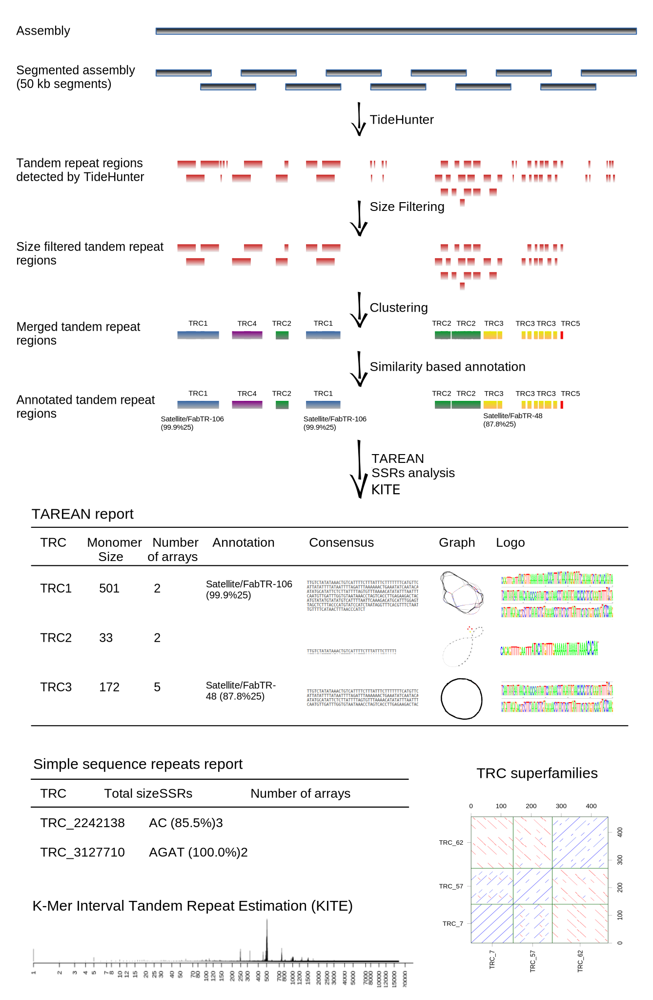

# TideCluster

TideCluster is a software tool designed to identify tandem repeats in genome 
assemblies by utilizing Tidehunter to detect tandem repeats clustering these repeats
based on similarity using mmseqs2 and NCBI BLAST. The software runs in four steps as  
outlined below:

**Tidehunter step**: In this initial step, Tidehunter is utilized to identify tandem 
repeats. As TideHunter's performance diminishes with larger sequences, the input fasta 
file is divided into smaller overlapping segments, with each segment analyzed 
individually.  Results from individual segments are parsed and merged into a single 
GFF3 file.  Tandem repeats detected in this step are often fragmented into multiple  
overlapping pieces.

**Clustering step**: Prior to clustering, all arrays that do not meet the minimum length 
requirement are removed from the analysis and saved in a separate GFF3 file. Arrays 
exceeding the minimum length requirement are clustered based on similarity. 
Clustering occurs in two stages. First, mmseqs2 is employed in the initial round of 
clustering. The second round involves an all-to-all comparison using NCBI-BLAST, 
followed by graph-based  clustering. The GFF3 file from the Tidehunter step is updated 
to include cluster assignment information. Simple sequence repeats are excluded from 
the clustering step and are analyzed separately.

**Annotation step**: Consensus sequences from TideHunter for each cluster are examined by 
RepeatMasker against a library of tandem repeats. The resulting annotation for each 
tandem repeat is used to update the information in the GFF3 file. This step is optional.

**TAREAN step**: In this final step, the Tandem Repeat Analyzer (TAREAN) estimates 
consensus sequences using a k-mer-based approach on the original sequences from the  
reference. Consensus sequences of simple sequence repeats are evaluated separately,  
as TAREAN performs poorly on tandem repeats with short monomers. The results of the  
analysis are saved in an HTML summary.

|  |
|:-----------------------------------------------:|
|           TideCluster workflow scheme           |

## Installation

TideCluster is available on Anaconda repository. To install TideCluster run we 
recommend to install it using [Mamba](https://github.com/mamba-org/mamba) an extremely 
fast replacement for the Conda package manager

In case you do not have Mamba installed, you can install it using conda to your base 
environment:

```bash
conda install -n base -c conda-forge mamba
```

Then install TideCluster using Mamba:
    
```bash
mamba create -n tidecluster -c conda-forge -c bioconda -c petrnovak tidecluster
```


## Usage

```help
usage: TideCluster.py [-h] [-v] {tidehunter,clustering,annotation,tarean,run_all} ...

Wrapper of TideHunter
    This script enable to run TideHunter on large fasta files in parallel. It splits
    fasta file into chunks and run TideHunter on each chunk. Identified tandem repeat 
    are then clustered, annotated and representative consensus sequences are extracted.
    
     
    

positional arguments:
  {tidehunter,clustering,annotation,tarean,run_all}
                        TideHunter wrapper
    tidehunter          Run wrapper of TideHunter
    clustering          Run clustering on TideHunter output
    annotation          Run annotation on output from clustering stepusing reference library of tandem repeats
    tarean              Run TAREAN on clusters to extract representative sequences
    run_all             Run all steps of TideCluster

options:
  -h, --help            show this help message and exit
  -v, --version         show program's version number and exit

    Example of usage:
    
    # first run tidehunter on fasta file to generate raw GFF3 output
    TideCluster.py tidehunter -c 10 -f test.fasta -pr prefix 
    
    # then run clustering on the output from previous step to cluster similar tandem repeats
    TideCluster.py clustering -c 10 -f test.fasta -pr prefix  -m 5000
    
    # then run annotation on the clustered output to annotate clusters with reference
    # library of tandem repeats in RepeatMasker format
    TideCluster.py annotation -c 10 -pr prefix -l library.fasta
    
    # then run TAREAN on the annotated output to extract representative consensus
    # and generate html report
    TideCluster.py  tarean -c 10 -f test.fasta -pr prefix
    
    Recommended parameters for TideHunter:
    short monomers: -T "-p 10 -P 39 -c 5 -e 0.25"
    long monomers: -T "-p 40 -P 3000 -c 5 -e 0.25" (default)
    
    For parallel processing include -c option before command name. 
    
    For more information about TideHunter parameters see TideHunter manual.
    
    Library of tandem repeats for annotation step are sequences in RepeatMasker format
    where header is in format:
    
    >id#clasification
```

## TideHunter step

```help
usage: TideCluster.py tidehunter [-h] -f FASTA -pr PREFIX [-T [TIDEHUNTER_ARGUMENTS]] [-c CPU]

options:
  -h, --help            show this help message and exit
  -f FASTA, --fasta FASTA
                        Path to reference sequence in fasta format
  -pr PREFIX, --prefix PREFIX
                        Base name for output files
  -T [TIDEHUNTER_ARGUMENTS], --tidehunter_arguments [TIDEHUNTER_ARGUMENTS]
                        additional arguments for TideHunter in quotes, default value: -p 40 -P 3000 -c 5 -e 0.25)
  -c CPU, --cpu CPU     Number of CPUs to use
```

## Clustering step

```help
usage: TideCluster.py clustering [-h] -f FASTA [-m MIN_LENGTH] -pr PREFIX [-g GFF] [-nd] [-c CPU]

options:
  -h, --help            show this help message and exit
  -f FASTA, --fasta FASTA
                        Reference fasta
  -m MIN_LENGTH, --min_length MIN_LENGTH
                        Minimum length of tandem repeat, default (5000)
  -pr PREFIX, --prefix PREFIX
                        Prefix is used as a base name for output files.If --gff is not provided, prefix will be also usedto identify GFF file from previous tidehunter step
  -g GFF, --gff GFF     GFF3 output file from tidehunter step. If not provided the file named 'prefix_tidehunter.gff3' will be used
  -nd, --no_dust        Do not use dust filter in blastn when clustering
  -c CPU, --cpu CPU     Number of CPUs to use

```

## Annotation step

```help
usage: TideCluster.py annotation [-h] -pr PREFIX [-g GFF] [-cd CONSENSUS_DIRECTORY] -l LIBRARY [-c CPU]

options:
  -h, --help            show this help message and exit
  -pr PREFIX, --prefix PREFIX
                        Prefix is used as a base name for output files.If --gff is not provided, prefix will be also usedto identify GFF3 file from previous clustering step
  -g GFF, --gff GFF     GFF3 output file from clustering step. If not provided the file named 'prefix_clustering.gff3' will be used
  -cd CONSENSUS_DIRECTORY, --consensus_directory CONSENSUS_DIRECTORY
                        Directory with consensus sequences which are to be annotated. If not provided the directory named 'prefix_consensus' will be used
  -l LIBRARY, --library LIBRARY
                        Path to library of tandem repeats
  -c CPU, --cpu CPU     Number of CPUs to use
```

LIBRARY is fasta file with tandem repeats reference library.
Required format for sequence names  in fasta is `>seqid#class/subclass`


## TAREAN step

```help
usage: TideCluster.py tarean [-h] [-g GFF] -f FASTA -pr PREFIX [-c CPU]

options:
  -h, --help            show this help message and exit
  -g GFF, --gff GFF     GFF3 output file from annotation or clustering stepIf not provided the file named 'prefix_annotation.gff3' will be used instead. If 'prefix_annotation.gff3' is not
                        found, 'prefix_clustering.gff3' will be used
  -f FASTA, --fasta FASTA
                        Reference fasta
  -pr PREFIX, --prefix PREFIX
                        Prefix is used as a base name for output files.If --gff is not provided, prefix will be also usedto identify GFF3 files from previous clustering/annotation step
  -c CPU, --cpu CPU     Number of CPUs to use
  -M MIN_TOTAL_LENGTH, --min_total_length MIN_TOTAL_LENGTH
                        Minimum combined length of tandem repeat arrays within a single cluster, required for inclusion in TAREAN analysis.Default (50000)
                        
```

## Run all steps

```help
usage: TideCluster.py run_all [-h] -f FASTA -pr PREFIX [-l LIBRARY] [-m MIN_LENGTH] [-T [TIDEHUNTER_ARGUMENTS]] [-nd] [-c CPU]

options:
  -h, --help            show this help message and exit
  -f FASTA, --fasta FASTA
                        Reference fasta
  -pr PREFIX, --prefix PREFIX
                        Base name used for input and output files
  -l LIBRARY, --library LIBRARY
                        Path to library of tandem repeats
  -m MIN_LENGTH, --min_length MIN_LENGTH
                        Minimum length of tandem repeat (5000)
  -T [TIDEHUNTER_ARGUMENTS], --tidehunter_arguments [TIDEHUNTER_ARGUMENTS]
                        additional arguments for TideHunter in quotes, default value: -p 40 -P 3000 -c 5 -e 0.25)
  -nd, --no_dust        Do not use dust filter in blastn when clustering
  -c CPU, --cpu CPU     Number of CPUs to use
  -M MIN_TOTAL_LENGTH, --min_total_length MIN_TOTAL_LENGTH
                        Minimum combined length of tandem repeat arrays within a single cluster, required for inclusion in TAREAN analysis.Default (50000)
```

## Example for full pipeline

```help
TideCluster.py tidehunter -c 40 -pr cen6_sat -f CEN6_ver_220406.fasta 
TideCluster.py clustering -c 40 -pr cen6_sat -f CEN6_ver_220406.fasta
TideCluster.py annotation -c 40 -pr cen6_sat -l library.fasta
TideCluster.py tarean -c 40 -pr cen6_sat -f CEN6_ver_220406.fasta

# or simpli run all steps at once
TideCluster.py run_all -c 40 -pr cen6_sat -f CEN6_ver_220406.fasta -l library.fasta 
```

## Output

### Tidehunter Step

- `prefix_tidehunter.gff3` - GFF3 file with tandem repeats detected by TideHunter.
- `prefix_chunks.bed` - BED file showing how the reference sequence was split into chunks for parallel processing.

### Clustering Step

- `prefix_clustering.gff3` - GFF3 file with tandem repeats identified by `mmseqs2` and `BLASTN`. 
  Tandem repeat regions in the GFF3 file are labeled by **T**andem **R**epeat **C**luster ID (TRC1, TRC2, etc.). Each TRC is described by the `repeat_type` attribute. `repeat_type` can be either TR (Tandem Repeat) or SSR (Simple Sequence Repeat).
- `prefix_clustering.gff3_1.gff3` - Intermediate file with tandem repeats clustered by `mmseqs2`.
- `prefix_consensus` - Directory with consensus sequences for each cluster as identified by TideHunter. There is one FASTA file per cluster. Each FASTA file contains all consensus sequences identified by TideHunter for a given cluster. 
- `prefix_consensus_1` - Intermediate directory with consensus sequences for each cluster as identified by `mmseqs2`. 

### Annotation Step

- `prefix_annotation.gff3` - GFF3 file with tandem repeats annotated by RepeatMasker. 
  Annotations are shown as additional attributes in the GFF3 file.
- `prefix_annotation.tsv` - Summarized annotation for each TRC cluster in a tab-delimited format. 

### TAREAN Step

- `prefix_tarean_report.html` - HTML report with tandem repeat annotations. 
- `prefix_tarean_report.tsv` - File with tandem repeat annotations in a tab-delimited format.
- `prefix_tarean` - Directory containing subdirectories with detailed TAREAN output for each TRC cluster.


## Updating gff3 file based on manual annotation
If you want to update GFF3 file with manual annotation, you can use `update_gff3.py` 
script. This script will update "Name" attribute in GFF3" based on the conversion 
table. Conversion table is tab-delimited file with two columns. First column is 
original value is Name attribute and the second column is new value for Name.


```help
usage: update_gff3.py [-h] -g GFF3 -t TABLE -o OUTPUT [-a ATTRIBUTE_NAME]

Update gff3 attributes based on conversion table.

options:
  -h, --help            show this help message and exit
  -g GFF3, --gff3 GFF3  gff3 file
  -t TABLE, --table TABLE
                        Conversion table as tab-delimited file. First column if original attribute value, second column is new attribute value.
  -o OUTPUT, --output OUTPUT
                        output file gff3
  -a ATTRIBUTE_NAME, --attribute_name ATTRIBUTE_NAME
                        attribute name to update, default attribute is "Name"

```

## Credits

TideCluster utilizes Tidehunter [https://github.com/Xinglab/TideHunter] for tandem repeat detection and TAREAN for reconstruction of consensus sequences of tandem repeats.
If you use TideCluster please cite:
- https://github.com/kavonrtep/TideCluster
- TAREAN: a computational tool for identification and characterization of satellite DNA from unassembled short reads (https://doi.org/10.1093/nar/gkx257) 
- TideHunter: efficient and sensitive tandem repeat detection from noisy long-reads using seed-and-chain (https://doi.org/10.1093/bioinformatics/btz376)

### Authors

Petr Novak, Jiri Macas,  Laboratory of Molecular Cytogenetics, Biology Centre CAS, Czech Republic

## License

GNU General Public License v3.0
